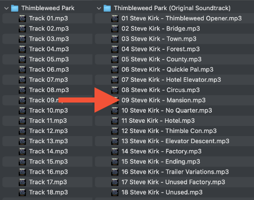

# mp3rename

[](https://github.com/MichaelKaaden/rust_mp3rename/commits/master)
[](https://github.com/MichaelKaaden/rust_mp3rename/releases)
[](https://travis-ci.com/MichaelKaaden/rust_mp3rename)
[](https://github.com/MichaelKaaden/rust_mp3rename/issues)
[](https://github.com/MichaelKaaden/redux-server)

This command line utility has only one purpose: It traverses a directory tree and renames all music files it discovers
and, optionally, the directories containing them according to the tags in the music files.

Running `mp3rename -d "./Thimbleweed Park"` yielded the following result:



If I had used `mp3rename -ad "./Thimbleweed Park"`, the artist would have been left out as it is the same for all music
files in this directory.

## Requirements

The program searches for music files with an extension in `<mp3|flac|m4a|m4b|m4p|m4v>`.

The tags for the track number, track tile, artist name, and album name are mandatory. Without them, the program will
omit the files.

## Installation

Download one of the Linux, macOS, or Windows binaries from
the [releases](https://github.com/MichaelKaaden/rust_mp3rename/releases) page.

To build this crate from source and install it, please use `cargo install --path .` in this project's root directory.

## Running the CLI Tool

Doing a dry run on Linux and macOS is as simple as

`$ mp3rename -adrn <my music dir>`

To redirect output as well as error messages to some files you'd like to inspect later, you'd use

`$ mp3rename -adrn <my music dir> > output 2> errors`

### Full usage message

```text
USAGE:
    mp3rename [FLAGS] [OPTIONS] <START_DIR>

FLAGS:
    -a, --artist         Removes the artist from the filename if it is the same for all files in a directory
    -d, --directory      Renames directories according to the album tag
    -n, --dry-run        Uses dry-run mode
    -h, --help           Prints help information
    -o, --omit-artist    Omit artist
    -r, --remove         Removes non-music files
    -V, --version        Prints version information
    -v, --verbose        Be verbose

OPTIONS:
    -l, --limit-length <LENGTH>    Limits the file and directory names to <LENGTH> characters

ARGS:
    <START_DIR>    The directory to start from
```

## Result

The resulting file name will have the form

`<Disc Number> - <Track Number> <Artist> - <Track Title>.<extension>`.

When using the `--artist` flag and the "Artist" tag is the same for the whole directory, the file name will be shortened
to

`<Disc Number> - <Track Number> <Track Title>.<extension>`.

Optionally, the directory containing the music files will be renamed to the album title (if it is the same for all music
files within this directory).

If no disc numbers are given, the disc number part is left out.
